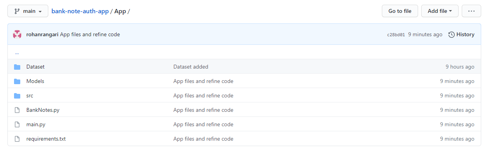
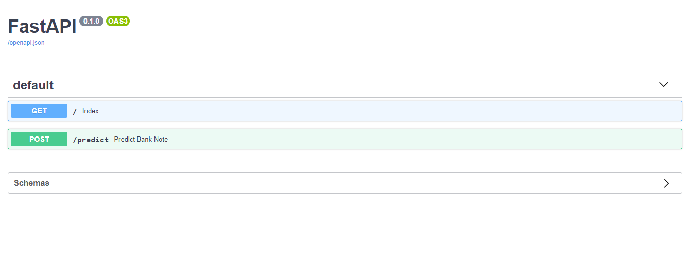
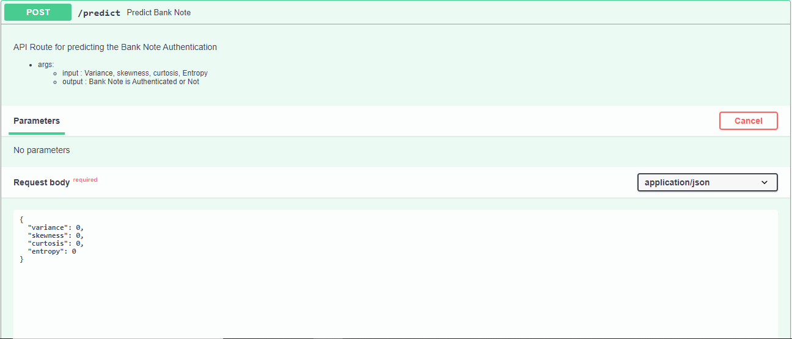

# bank-note-auth-app

Bank Note Authentication

## Data Source

https://www.kaggle.com/ritesaluja/bank-note-authentication-uci-data

## Descrption

Data were extracted from images that were taken from genuine and forged banknote-like specimens. For digitization, an industrial camera usually used for print inspection was used. The final images have 400x 400 pixels. Due to the object lens and distance to the investigated object gray-scale pictures with a resolution of about 660 dpi were gained. Wavelet Transform tool were used to extract features from images.

## Project Structure

- Src : Contains all the codes
- Models : Contains all the trained & stored Models
- Data : Contains all the data for training and testing
- app.py : Host routes & runs the app
- .gitingore: Contains all the extensions to be ignored by git
- Readme.md : Contains all the describtion for the app
- requirements.txt : Contains all the dependencies for the app
  

## Running the Application

unicorn app:app --reload
http://127.0.0.1:8000/docs

